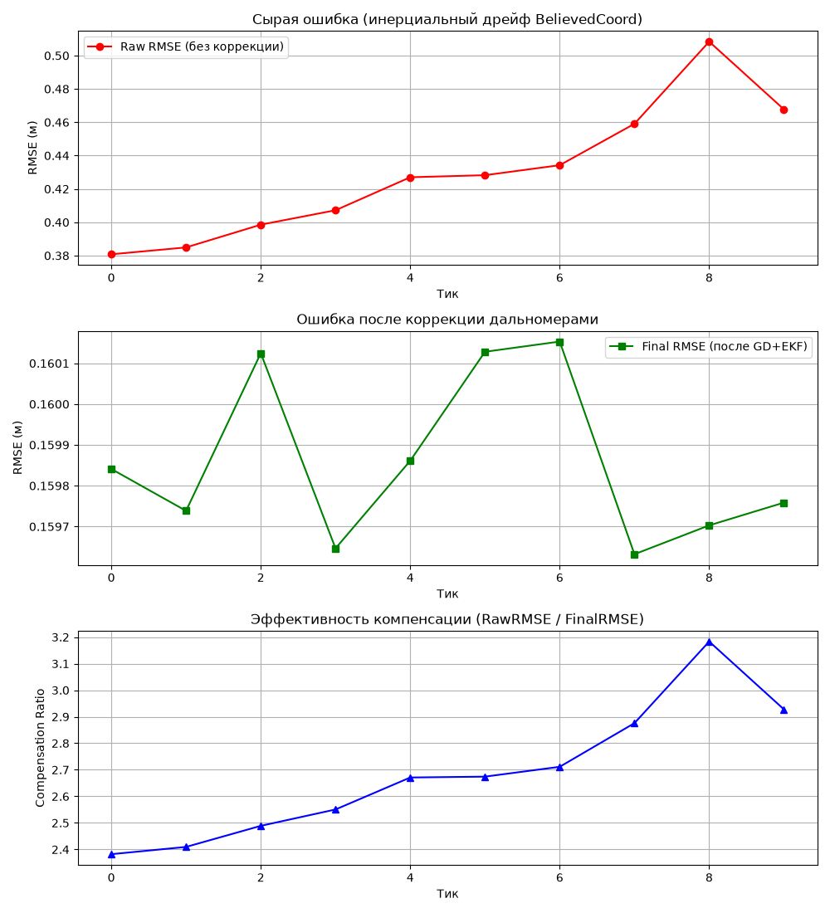

# Результаты тестов

## Методология

В проекте нет модульных (`*_test.go`) тестов — предметная область (стохастическая симуляция с рекурсивным фильтром) проверяется не unit-тестами отдельных функций, а сквозными регрессионными прогонами всей системы на наборе контрольных сценариев `config/*.toml` (см. [03_structure.md](03_structure.md)). Каждый сценарий целенаправленно проверяет одну грань поведения системы: качество навигации, качество дальномеров, масштаб сцены, плотность сети, число опорных узлов.

Прогон выполнен через испытательный стенд `testbench.py` (пакетный режим, все 10 конфигов подряд) на коммите `9fe1e31` + незакоммиченные изменения ветки `feat/move` (см. [04_history.md](04_history.md), неделя 4), 20.07.2026. Полный консольный вывод каждого прогона и графики сохранены в `report.md` и `report_images/`; ключевые графики продублированы в `docs/images/` для использования в этом документе.

Используемые метрики (см. [02_concept.md](02_concept.md)):

- **RawRMSE** — ошибка навигационного дрейфа без коррекции;
- **FinalRMSE** — ошибка итоговой оценки `CurrentCoord` после GD+EKF(+Кабш);
- **ShapeRMSE** — ошибка чистой геометрии сети после совмещения по Кабшу с истиной (без учёта ошибки абсолютной привязки);
- **CompensationRatio** = RawRMSE / FinalRMSE — во сколько раз коррекция снижает ошибку по сравнению с чистым дрейфом (> 1 означает, что коррекция полезна).

## Сводная таблица (итог по 10 тикам динамики)

| Сценарий | N | Анкеров | RawRMSE, м | FinalRMSE, м | ShapeRMSE, м | Ratio (тик 9) |
|---|---|---|---|---|---|---|
| `00_base` | 8 | 0 | 0.468 | 0.160 | 0.012 | 2.93 |
| `01_bad-gps` | 8 | 0 | 46.910 | 30.027 | 0.078 | 1.56 |
| `02_bad-sensors` | 8 | 0 | 2.973 | 3.259 | 2.499 | 0.91 |
| `03_edge-micro` | 5 | 0 | 0.493 | 0.191 | 0.016 | 2.58 |
| `04_edge-macro` | 10 | 0 | 139.383 | 52.830 | 9.090 | 2.64 |
| `05_dense` | 50 | 0 | 5.130 | 1.497 | 0.917 | 3.43 |
| `06_anc1` | 8 | 1 | 9.038 | 1.660 | 0.163 | 5.44 |
| `07_anc2` | 8 | 2 | 7.942 | 1.662 | 0.124 | 4.78 |
| `08_anc3` | 8 | 3 | 8.425 | 0.198 | 0.152 | 42.66 |
| `09_anc_bad-gps` | 8 | 3 | 39.237 | 0.073 | 0.047 | 539.90 |

(значения RawRMSE/FinalRMSE/ShapeRMSE/Ratio — из строки последнего тика (9) каждого прогона; полная динамика по тикам — в `report.md`.)

## Интерпретация по сценариям

### `00_base` — базовый сценарий

Хорошая навигация (gps_err = 0.5) и почти идеальные дальномеры (dist_err = 0.02). Статическая коррекция снижает RMSE с 0.38 до 0.16 м за 169 итераций GD. `ShapeRMSE` держится на уровне ~0.01–0.016 м — геометрия сети восстанавливается почти идеально, основная часть остаточной ошибки (0.16 м) — это ошибка абсолютной привязки, наследуемая от исходного навигационного шума через Кабша. `CompensationRatio` растёт от 2.38 до 2.93 к концу прогона — коррекция стабильно эффективна.

### `01_bad-gps` — плохая навигация

Экстремальная начальная ошибка навигации (gps_err = 45 м) при точных дальномерах (dist_err = 0.1 м). `ShapeRMSE` ≈ 0.06–0.10 м — геометрия сети восстанавливается почти идеально (на уровне точности дальномеров), что подтверждает: проблема с плато `FinalRMSE` ≈ 30 м, отмеченная в `docs/legacy/logic_refactor_plan.md`, полностью объясняется ошибкой абсолютной привязки (наследуется от начального гигантского навигационного шума через Кабша), а не проблемой в самом алгоритме сборки формы. `CompensationRatio` стабилен на уровне 1.56 — коррекция улучшает результат, но её потолок ограничен тем, что без анкеров абсолютная система отсчёта физически не может быть точнее исходной навигационной привязки.

### `02_bad-sensors` — плохие дальномеры

Единственный сценарий, где `CompensationRatio` на части тиков опускается ниже 1 (0.82–1.03) — коррекция не всегда помогает, но и не катастрофически вредит (в отличие от исходного дефекта из недели 2, где ratio падал до 0.58, см. `docs/legacy/logic_refactor_plan.md`). Байесовское взвешивание (вес привязки к навигации `distErr²/Uncertainty²`) корректно распознаёт, что дальномеры (dist_err = 12 м) намного хуже навигации (gps_err = 3 м), и не позволяет коррекции сильно испортить исходную оценку. `ShapeRMSE` близка к `FinalRMSE` (2.0–3.0 м) — геометрия сети собирается плохо, что ожидаемо при таком уровне шума дальномеров, соизмеримом с размером сцены.

### `03_edge-micro` — малый масштаб (2×2×2 м)

Критически малый шаг GD (`alpha = 0.0005`) требуется из-за масштаба сцены — при бо́льшем шаге алгоритм расходится. С этим шагом GD не сходится по `epsilon` за отведённые 5000 итераций (использует весь лимит), но `ShapeRMSE` всё равно снижается до ~0.016–0.028 м — приемлемый результат для комнаты размером 2 метра. Подтверждает, что численная схема работает на предельно малых масштабах, но требует точной ручной настройки `alpha`/`max_iter` под конкретный масштаб сцены.

### `04_edge-macro` — большой масштаб (50×50×50 км)

Ключевой стресс-тест устойчивости: огромный шаг `alpha = 5.0` необходим для сцены такого масштаба. NaN не возникает ни на одном из 10 тиков — механизм отката неудачного шага (см. [02_concept.md](02_concept.md)) успешно защищает от расходимости на масштабе, который до его внедрения приводил к NaN на итерации 0 (см. `docs/legacy/logic_refactor_plan.md`). `ShapeRMSE` снижается от 16.0 до 9.1 м на фоне сцены 50 км — относительная точность около 0.02% от масштаба сцены.

### `05_dense` — плотная сеть (50 узлов)

Стресс-тест производительности и численной устойчивости при большом числе связей. Прогон завершается за разумное время. `CompensationRatio` стабилен и даже растёт (3.09 → 3.43) — увеличение числа измерений на узел (при фиксированном k=7 в густой сети измерения более информативны за счёт большего числа соседей на единицу объёма) не ухудшает сходимость.

### `06_anc1`, `07_anc2` — один и два анкера

При 1–2 анкерах `FinalRMSE` стабилизируется на уровне ~1.6–1.7 м, `CompensationRatio` — 4.7–5.5. Анкеры частично компенсируют смещение системы, но малое их число (1–2 из 8) оставляет значительную часть сети слабо ограниченной анкерами напрямую — итоговая точность существенно хуже, чем в сценарии с тремя анкерами.

### `08_anc3` — три анкера

Три анкера полностью устраняют вращение и сдвиг системы без необходимости в Кабше. `FinalRMSE` падает до ~0.16–0.30 м — на порядок точнее, чем при 1–2 анкерах. `CompensationRatio` резко возрастает (28–47) — характерный скачок при достаточном для однозначной фиксации системы отсчёта числе анкеров (для 3D-локализации минимально необходимы 3–4 неколлинеарных опорных точки).

### `09_anc_bad-gps` — три анкера при сильном навигационном шуме

Показательный сценарий: несмотря на экстремальный навигационный шум (gps_err = 45 м, тот же уровень, что в `01_bad-gps`), при наличии 3 анкеров `FinalRMSE` падает до 0.05–0.36 м — на два порядка точнее, чем в `01_bad-gps` без анкеров (где тот же уровень шума давал плато ~30 м). `CompensationRatio` достигает 539.90 на последнем тике — крайний случай, когда анкеры полностью компенсируют даже очень плохую навигацию. Это прямое экспериментальное подтверждение вывода из [01_postanovka_zadachi.md](01_postanovka_zadachi.md): при отсутствии анкеров абсолютная точность локализации ограничена точностью исходной навигационной привязки, а с достаточным числом анкеров — только точностью дальномеров.

## Графики

Для каждого сценария сохранены три графика (`docs/images/`):

- `gd_<сценарий>.png` — сходимость координат первого подвижного узла в градиентном спуске, сквозная история по всем тикам;
- `ekf_<сценарий>.png` — то же для траектории EKF;
- `ticks_<сценарий>.png` — динамика RawRMSE, FinalRMSE и CompensationRatio по тикам (три отдельные панели ввиду разницы масштабов на 2–3 порядка).

Пример — базовый сценарий:

Полный набор графиков по всем 10 сценариям — в каталоге `docs/images/`, а также в накопительном журнале `report.md`.

## Общий вывод

Регрессионный набор из 10 сценариев подтверждает три ключевых свойства системы:

1. **Устойчивость** — ни один сценарий (включая экстремальные `03_edge-micro` и `04_edge-macro`) не приводит к NaN/Inf в решении.
2. **Корректность байесовского взвешивания** — коррекция никогда не ухудшает результат катастрофически даже при заведомо плохих дальномерах (`02_bad-sensors`, ratio не ниже 0.82).
3. **Ожидаемая роль анкеров** — при отсутствии анкеров точность локализации ограничена исходной навигационной привязкой (устраняется Кабшем только для формы сети, не для абсолютного положения); три и более анкеров полностью устраняют это ограничение и дают точность на уровне качества дальномеров, независимо от качества исходной навигации.
